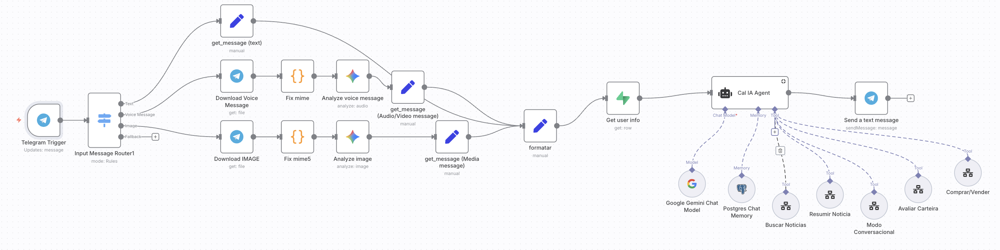
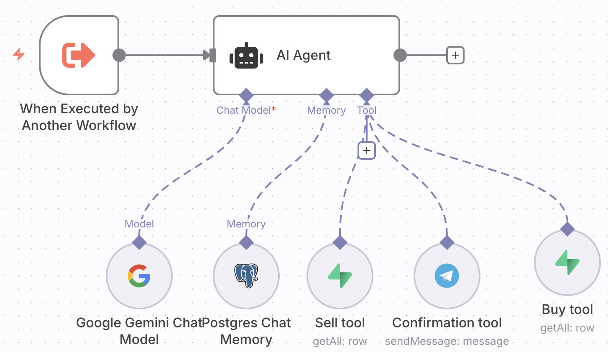
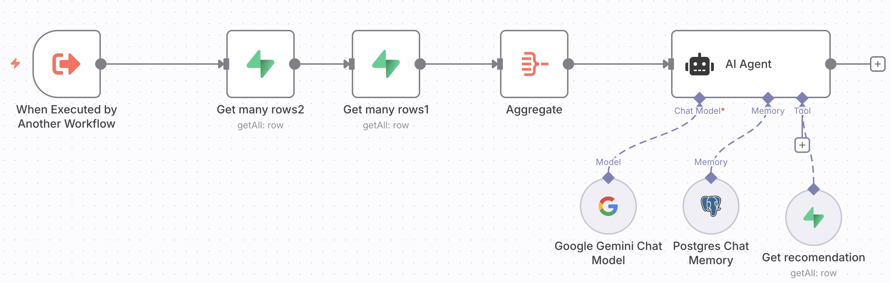

# Agente Financeiro para Telegram BTG
## Nome da equipe: 93
## Participantes
- Arthur Alexandre Santos Santana  
- Arthur Martins Pereira  
- Christyan Paniago Nantes  
- Giovanna Nascimento Noventa  

---

## Funcionalidades - Agentes
### Orquestrador
Delega as funções entre os devidos agentes, assim como recebe as entradas e saídas.

### Buy/Sell
Permite a compra e venda de ativos de forma rápida.

### Notícias
Busca as notícias do Research do BTG Pactual mais relevantes para o portfólio do usuário.

### Resumo de notícias
Permite a síntese das notícias do Research do BTG Pactual: busca a notícia completa através de um link e resume-a.

### Analisar carteira
Busca os ativos do portfólio do usuário e analisa como aqueles ativos estão se comportando com o tempo.

### Conversacional
Gera recomendações de investimento e gerencia conversas gerais.

---

## Features
- Sistema de entrada multimodal, com entradas de vídeo, texto e imagem
- Integração com o Telegram
- Integração com o Google Gemini
- Integração com banco de dados PostgreSQL (Supabase) para contexto e dados de usuários, notícias e ativos.
